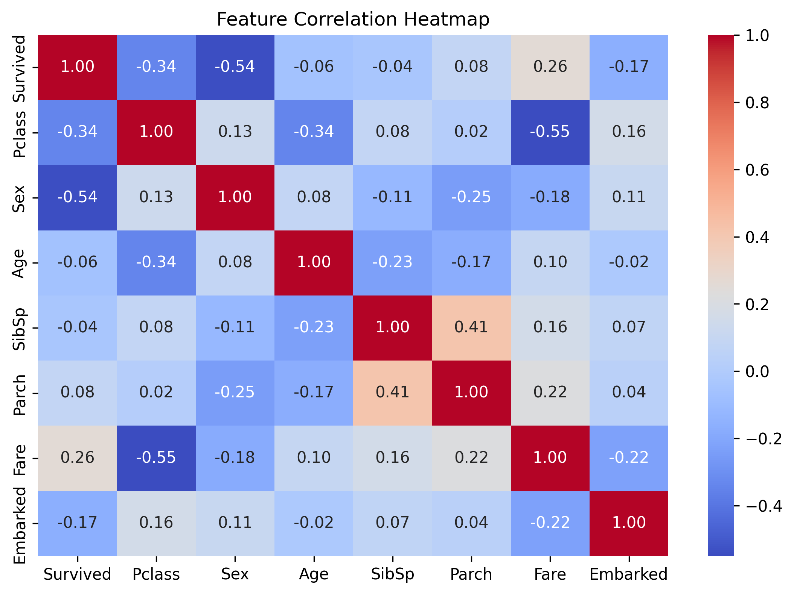
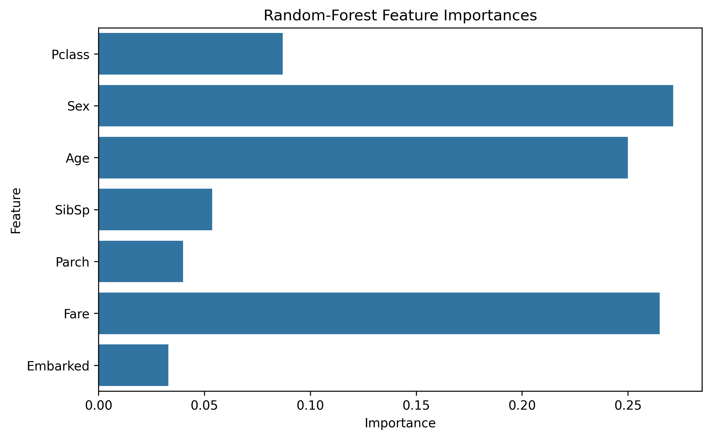

# 🚢 Titanic Survival Prediction – Task-2: Predictive Analysis

This project is part of an internship task where we aim to predict passenger survival on the Titanic using supervised machine learning. The dataset is preprocessed, a model is trained using `RandomForestClassifier`, and results are visualized and saved offline.

---

## 🔍 Project Objective

- Analyze the Titanic dataset to predict whether a passenger survived or not.
- Clean and preprocess the data.
- Train a machine learning model.
- Evaluate model performance.
- Generate and save evaluation metrics and visualizations.
- Export results to `.txt`, `.csv`, and `.png` files offline.

---

## 📊 Dataset Overview

**Source**: [Kaggle Titanic Dataset](https://www.kaggle.com/c/titanic/data)

| Column       | Description                            |
|--------------|----------------------------------------|
| PassengerId  | Passenger identifier                   |
| Survived     | Target variable (0 = No, 1 = Yes)      |
| Pclass       | Ticket class (1 = 1st, 2 = 2nd, 3 = 3rd)|
| Name         | Name of passenger                      |
| Sex          | Gender                                 |
| Age          | Age in years                           |
| SibSp        | Siblings / Spouses aboard              |
| Parch        | Parents / Children aboard              |
| Ticket       | Ticket number                          |
| Fare         | Ticket fare                            |
| Cabin        | Cabin number                           |
| Embarked     | Port of embarkation (C = Cherbourg, Q = Queenstown, S = Southampton) |

---

## 🔧 Data Preprocessing

- **Missing values** handled:
  - `Age` → filled with median
  - `Embarked` → filled with mode
- **Dropped columns**:
  - `Name`, `Ticket`, and `Cabin` (not useful for model)
- **Encoding**:
  - `Sex` and `Embarked` columns are encoded using `LabelEncoder`

---

## 🧠 Model Details

- **Algorithm**: `RandomForestClassifier` from `sklearn.ensemble`
- **Train/Test Split**: 80% training, 20% testing
- **Features used**:
  - `Pclass`, `Sex`, `Age`, `SibSp`, `Parch`, `Fare`, `Embarked`

---

## 📈 Visualizations

Generated and saved as `.png` files:

1. **Correlation Heatmap** – Feature correlations
2. **Confusion Matrix** – Actual vs predicted labels
3. **Feature Importances** – Most important features contributing to prediction

---

## 📂 Output Files

All saved in your task folder:

| File Name                     | Description                                      |
|------------------------------|--------------------------------------------------|
| `evaluation_results.txt`     | Accuracy score, confusion matrix, classification report (text) |
| `evaluation_results.csv`     | Evaluation metrics in CSV format                |
| `correlation_heatmap.png`    | Heatmap of feature correlations                  |
| `confusion_matrix.png`       | Visual confusion matrix                          |
| `feature_importances.png`    | Feature importance from Random Forest model      |

---

## ▶ How to Run

### 1. Install Dependencies

Make sure you have Python installed (preferably 3.10+), then run:

```bash
pip install pandas numpy matplotlib seaborn scikit-learn
```

### 2. Run the Script

```bash
python task_2_predictive_analysis_with_outputs.py
```

You should see outputs printed in the terminal and saved in the folder.

---

## 🧪 Evaluation Metrics

- **Accuracy Score** – Percentage of correctly predicted labels
- **Confusion Matrix** – Breakdown of true/false positives and negatives
- **Classification Report** – Includes:
  - Precision
  - Recall
  - F1-score
  - Support

---
### 📈 Visualization





## 💡 Future Improvements

- Tune hyperparameters using GridSearchCV or RandomizedSearchCV.
- Try other models like XGBoost, SVM, or Neural Networks.
- Use advanced imputation techniques for missing values.
- Perform feature engineering (e.g., title extraction from names).

---

## 👤 Author

**Name**: Peddapudi Naveenkumar  
**Program**: MSc Cybersecurity & Data Science  
**Institution**: ESAIP, France  
**Internship Task** – July 2025

---

## 📌 Notes

- All visual and result files are stored **offline**.
- Make sure you have write access to the specified folder.
- You can open PNG files using any image viewer and CSV files with Excel or a text editor.

---
